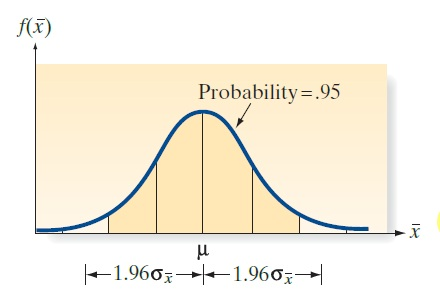
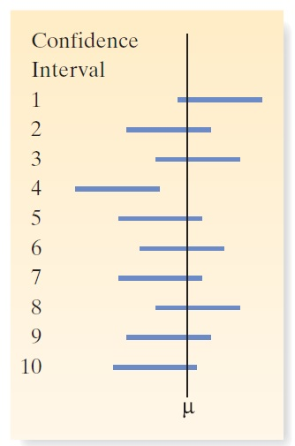

# 为什么可以用样本的一个范围作为置信区间？

这是一个非常核心的统计概念。本文将直观地解释为什么我们可以用一个样本计算出的范围（置信区间）来估计总体参数。

## 核心思想：从“点”估计到“范围”估计

1.  **点估计的局限**：我们用样本均值 $\bar{x}$ 来估计总体均值 $\mu$。但由于抽样误差，$\bar{x}$ 几乎不可能恰好等于 $\mu$。我们不知道这个误差有多大。
2.  **范围估计的优势**：置信区间提供了一个范围，并告诉我们这个范围有多大把握能“罩住”真正的 $\mu$。它同时提供了**估计值**和**估计的可靠性**。

---

## 为什么我们可以相信这个“范围”？

理解的关键在于 **“抽样分布”** 和 **“长期频率”** 的思想。

### 第一步：理解样本均值的波动规律（抽样分布）

想象我们不是只抽一个样本，而是**从同一个总体中重复抽取成千上万个**样本量均为 $n$ 的样本。

*   每个样本都能计算出一个样本均值 $\bar{x}_1, \bar{x}_2, \bar{x}_3, ...$。
*   这些 $\bar{x}$ 的值会形成一个分布，这个分布就叫**抽样分布**。

根据**中心极限定理**，只要样本量 $n$ 足够大，这个抽样分布就会近似是一个**正态分布**（钟形曲线）。

*   这个正态分布的**中心（均值）** 就是真正的总体均值 $\mu$。
*   这个正态分布的**宽度（标准差）** 称为**标准误（Standard Error, $SE$）**，计算公式为：
    $SE = \frac{\sigma}{\sqrt{n}}$
    （其中 $\sigma$ 是总体标准差）。

所以，样本均值 $\bar{X}$ 的分布是：
$\bar{X} \sim N(\mu, \frac{\sigma}{\sqrt{n}})$

*（示意图：抽样分布是一个以 $\mu$ 为中心的正态分布）*

### 第二步：利用正态分布的性质

对于一个完美的正态分布，我们有这个经验法则：
> 大约 **95%** 的数据点会落在“均值 ± **1.96** 个标准差”的范围内。

应用到我们的抽样分布上，就意味着：
> 在所有可能抽出的样本中，有大约 **95%** 的样本均值 $\bar{x}$ 会落在区间 $[\mu - 1.96 \times SE,  \mu + 1.96 \times SE]$ 之内。

用不等式表示就是：
$$\mu - 1.96 \times SE \leq \bar{X} \leq \mu + 1.96 \times SE$$

### 第三步：最关键的一步——思维转换

上面的不等式是在描述 $\bar{X}$ 如何围绕固定的 $\mu$ 分布。

但我们的问题是：$\mu$ 是未知的，我们只有一个样本计算出的 $\bar{x}$。所以我们把上面的不等式**等价变形**一下：

原不等式：
$$\mu - 1.96 \times SE \leq \bar{X} \leq \mu + 1.96 \times SE$$

**等价于**新不等式：
$$\bar{X} - 1.96 \times SE \leq \mu \leq \bar{X} + 1.96 \times SE$$

**新不等式的含义发生了根本变化：**
> 对于任何一次抽样得到的 $\bar{x}$，我们构造一个区间 $[\bar{x} - 1.96 \times SE,  \bar{x} + 1.96 \times SE]$。那么，在无数次重复这个构造过程后，有 **95%** 的区间会把真正的 $\mu$ 包含在内。

*（示意图：多次抽样构造出的区间，大部分包含了 $\mu$）*

---

## 总结与关键点

1.  **95%置信度的真正含义**：
    *   **它不是**指“我这个具体的区间有95%的概率包含 $\mu$”。$\mu$ 是一个固定值，要么在这个区间内，要么不在，没有概率可言。
    *   **它是指**：“我用这个方法构造出来的区间，在100次实践中，大约有95次能成功覆盖到 $\mu$。” 就像用一张网捕鱼，网的大小设计得在100次撒网中能捕到95次鱼，但某一次撒网，鱼要么在网里，要么不在。

2.  **区间宽度由什么决定**：
    *   **置信水平**：信心越大（如99% vs 95%），乘数（如2.58 vs 1.96）就越大，区间就越宽。
    *   **样本大小 ($n$)**：样本量 $n$ 越大，标准误 $SE = \frac{\sigma}{\sqrt{n}}$ 越小，区间就越窄，估计越精确。
    *   **数据波动 ($\sigma$)**：总体数据本身越分散（$\sigma$ 越大），区间就越宽。

3.  **实际操作**：我们通常不知道总体标准差 $\sigma$，所以会用样本标准差 $s$ 来估计它，公式变为 $SE = \frac{s}{\sqrt{n}}$。当样本量较小时，会使用 **t分布** 而不是正态分布来寻找合适的乘数（例如从 t 表中查 $t^{*}$ 值来代替 1.96），但其核心思想完全一样。

**结论**：我们之所以能用一个样本构造的范围（置信区间）来估计总体参数，是基于**抽样分布的理论**和**长期频率**的解释。它为我们提供了一个既包含估计值、又包含估计不确定性的强大工具。